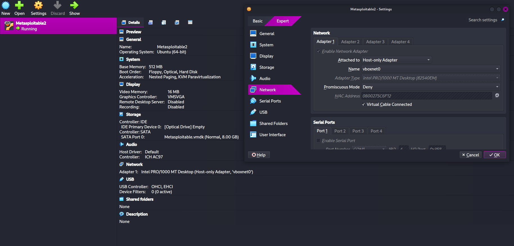
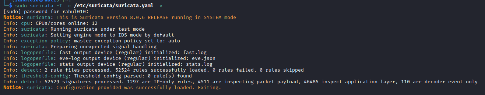
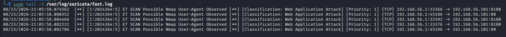
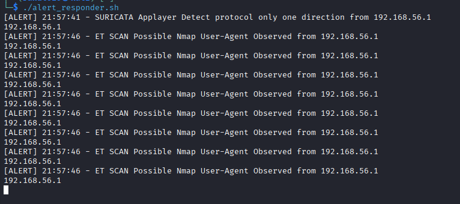
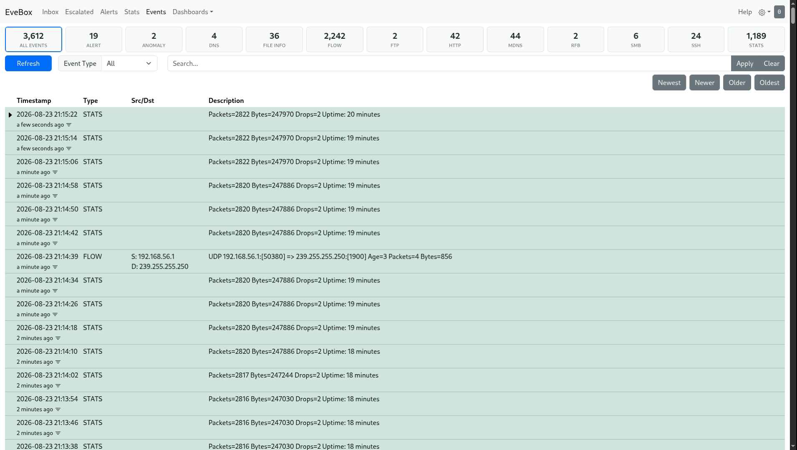

# Task 4 — Network Intrusion Detection System 🛡️

Part of the **CodSoft Cyber Security Virtual Internship**. A functional Network
Intrusion Detection System built with Suricata, tested against real attack
traffic in an isolated lab, with a custom detection rule, an automated
alerting script, and a graphical dashboard.

## 📌 Overview

This project configures **Suricata** as a network IDS on Kali Linux,
monitoring traffic to an intentionally vulnerable target (Metasploitable2) on
an isolated VirtualBox lab network. Alongside the default Emerging Threats
ruleset, a custom rule was written from scratch to detect SSH brute-force
attempts, tested against real Nmap and Hydra attacks, and hooked into a basic
automated response script. Alerts are visualized in **EveBox**, a
browser-based dashboard.

## 🎯 Objectives

- [x] Configure a network intrusion detection solution (Suricata)
- [x] Create and customize detection rules for suspicious/malicious activity
- [x] Continuously monitor incoming and outgoing network traffic
- [x] Generate alerts and implement basic response actions
- [x] **Bonus:** Build a dashboard to visualize detected attacks

## 🧰 Tools & Technologies

| Tool | Purpose |
|---|---|
| Kali Linux | Attacker machine + IDS sensor |
| VirtualBox (Host-only network) | Isolated lab network |
| Metasploitable2 | Intentionally vulnerable attack target |
| Suricata 8.0.6 | IDS engine |
| Nmap | Attack simulation — scanning |
| Hydra | Attack simulation — SSH brute force |
| EveBox | Alert visualization dashboard |
| Bash | Automated alert response |

## 🖧 Lab Architecture

Both machines sit on a private VirtualBox Host-only network (`vboxnet0`,
`192.168.56.0/24`), isolated from the real network — so all attack traffic
stays fully contained.

| Machine | Role | IP Address |
|---|---|---|
| Kali Linux | Attacker + Suricata sensor | `192.168.56.1` |
| Metasploitable2 | Vulnerable target | `192.168.56.101` |



## ⚙️ Setup Summary

1. Installed VirtualBox and created a Host-only Adapter (`vboxnet0`) to
   isolate the lab from the real network.
2. Imported Metasploitable2 as the attack target, attached to `vboxnet0`.
3. Installed Suricata on Kali and pointed it at the `vboxnet0` interface.
4. Pulled the free **Emerging Threats Open** ruleset via `suricata-update`
   (68,468 rules).
5. Verified end-to-end connectivity and packet capture before testing.



## 🧩 Custom Detection Rule

Rather than relying only on the default ruleset, a rule was written from
scratch to detect an SSH brute-force pattern — not just a single connection,
but repeated attempts from the same source in a short window:

```
alert tcp any any -> $HOME_NET 22 (msg:"SSH connection attempt"; sid:1000001; rev:1; detection_filter:track by_src, count 5, seconds 60;)
```

**How it works:**
- Matches any TCP traffic to port 22 (`$HOME_NET` = the protected lab network)
- `detection_filter` suppresses noise — it only fires once a **single source
  IP** crosses **5 matching connections within 60 seconds**, turning "someone
  connected to SSH" into "someone is brute-forcing SSH"
- `sid:1000001` — custom rules use IDs ≥ 1,000,000, reserved separately from
  official/community rulesets

Full rule file: [`rules/local.rules`](rules/local.rules)

## 🧪 Attack Simulation & Detection

### Nmap Scan → Default Ruleset

Running `nmap -sV` against the target triggered the Emerging Threats
ruleset immediately:

```
ET SCAN Possible Nmap User-Agent Observed — 192.168.56.1 → 192.168.56.101
```



### SSH Connection → Custom Rule

Connecting to the target's SSH service triggered the custom rule written
above, confirming it works as designed:

```
08/23/2026-20:53:40.094208  [**] [1:1000001:1] SSH connection attempt [**] [Classification: (null)] [Priority: 3] {TCP} 192.168.56.1:56972 -> 192.168.56.101:22
```

## 🚨 Alerts & Automated Response

A lightweight Bash script (`scripts/alert_responder.sh`) watches Suricata's
`eve.json` log in real time, and whenever a new alert appears, prints a
formatted warning to the terminal **and** logs it to a persistent incident
file — a basic automated response action without needing paid SOAR tooling.

```bash
tail -Fn0 /var/log/suricata/eve.json | while read line; do
    if echo "$line" | grep -q '"event_type":"alert"'; then
        msg=$(echo "$line" | grep -oP '(?<="signature":")[^"]*')
        src=$(echo "$line" | grep -oP '(?<="src_ip":")[^"]*')
        echo "[ALERT] $(date '+%H:%M:%S') - $msg from $src" | tee -a ~/incident_log.txt
    fi
done
```



## 📊 Bonus: Graphical Dashboard (EveBox)

[EveBox](https://evebox.org) provides a free, browser-based view of every
Suricata alert — searchable by timestamp, signature, and source/destination
IP, without needing a full ELK stack.



## 🧠 Key Learnings & Challenges

- Suricata rule anatomy — protocol, direction, `$HOME_NET`, and the
  `detection_filter` option for threshold-based (rather than per-packet)
  detection
- Debugged a real issue where duplicate Suricata processes were competing
  for the same interface, silently preventing new rule changes from taking
  effect
- Diagnosed and fixed an SSH handshake failure between modern Kali and the
  legacy (2008-era) crypto algorithms on Metasploitable2, by scoping
  `KexAlgorithms`/`Ciphers` overrides to that one host only
- Learned the difference between `suricata-update`'s rule-loading log and
  the live engine's startup log when verifying custom rules are active

## 📁 Repository Structure

```
task_2_Network-Intrusion-Detection-System/
├── README.md
├── rules/
│   └── local.rules
├── scripts/
│   └── alert_responder.sh
└── images/
    ├── lab-network-setup.png
    ├── suricata-rules-loaded.png
    ├── nmap-scan-alert.png
    ├── alert-responder-live.png
    └── evebox-dashboard.png
```

## 👤 Author

**Rahul Sunouri** — B.Tech CSE, Cyber Security Virtual Intern @ CodSoft
GitHub: [@EthRahul](https://github.com/EthRahul)
