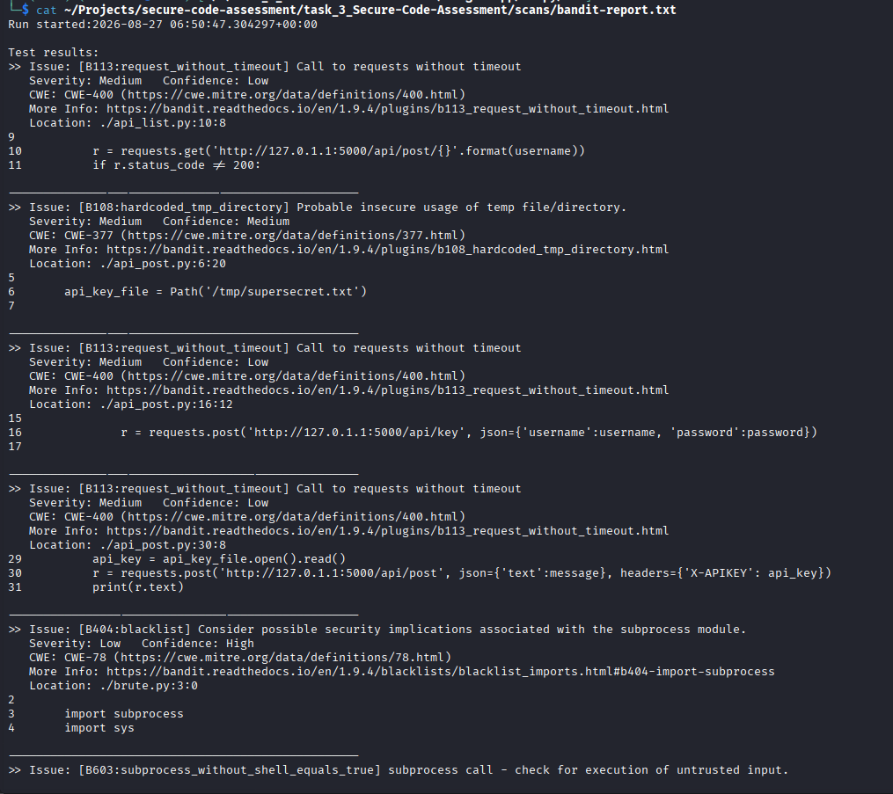
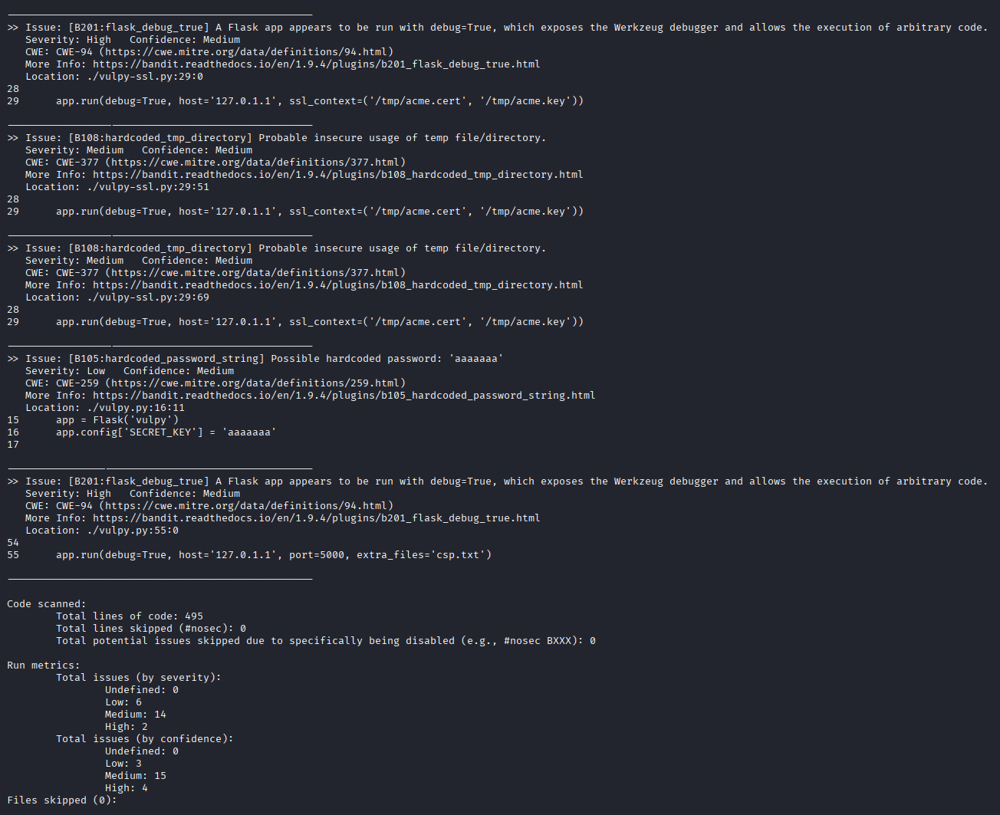
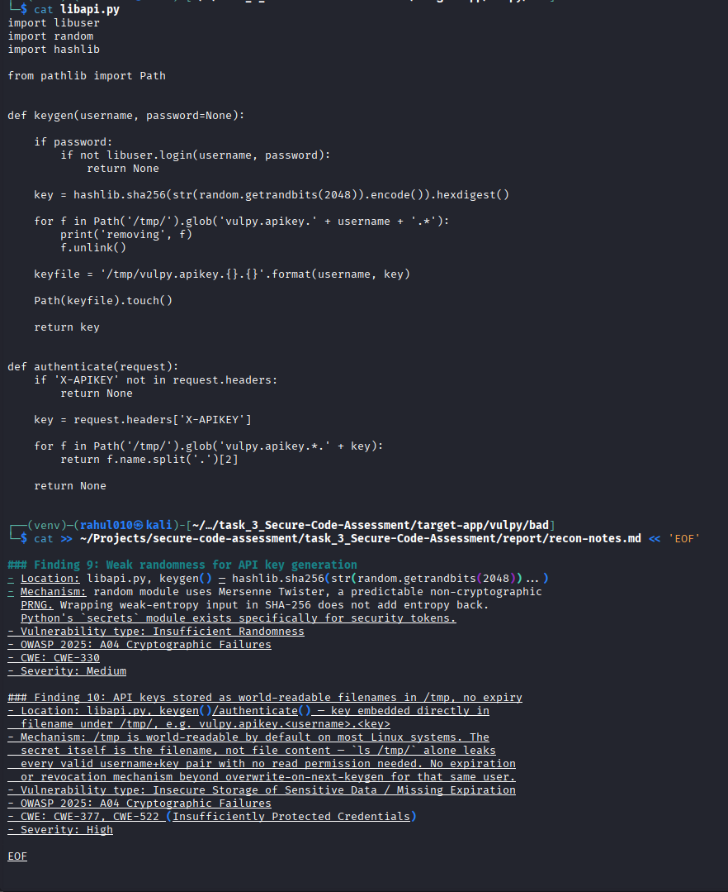
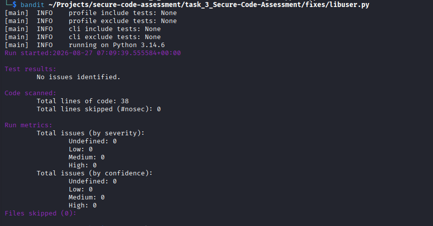
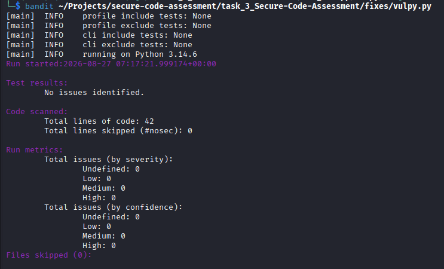

# 🛡️ Task 3: Secure Code Assessment
### CodSoft Cybersecurity Internship


-orange)


---

## 📖 Overview

A full source-code security audit of **Vulpy** — an intentionally vulnerable Flask application — combining manual line-by-line code review with automated static analysis (Bandit). Findings are classified against the **OWASP Top 10 (2025)**, and the four most critical vulnerabilities were remediated and verified.

## 🎯 Objective

- Perform a structured security review of an application's source code
- Identify common security weaknesses and coding flaws
- Use static analysis tooling alongside manual review
- Recommend and implement secure coding fixes
- Document everything in a professional vulnerability report

## 🧰 Tools & Technologies

| Category | Tool |
|---|---|
| Target Application | Vulpy (Flask) |
| Static Analysis (SAST) | Bandit |
| Language | Python 3 |
| Session Security (fix) | itsdangerous |
| Version Control | Git |
| Classification Framework | OWASP Top 10 (2025), CWE |

## 🔍 Methodology

1. Attack surface mapping — traced every route from the app entrypoint outward
2. Manual code review — authentication, session, MFA, and API logic reviewed end-to-end
3. Automated scanning — Bandit run across the full codebase, cross-validated against manual findings
4. Documentation — every finding logged with location, mechanism, OWASP/CWE mapping, and severity
5. Remediation — critical findings patched and re-scanned to confirm the fix
6. Reporting — consolidated into a professional assessment report

## 📊 Key Findings

| ID | Vulnerability | OWASP 2025 | Severity | Status |
|---|---|---|---|---|
| F04 | SQL Injection (auth bypass) | A05 Injection | Critical | Fixed |
| F06 | Unsigned session cookie (forgery) | A08 Integrity Failures | Critical | Fixed |
| F12 | Identity spoofing via API | A01 Broken Access Control | Critical | Fixed |
| F02 | Debug mode enabled (RCE risk) | A02 Misconfiguration | Critical | Fixed |
| F05 | Plaintext password storage | A04 Crypto Failures | High | Documented |
| F07 | No brute-force protection | A07 Auth Failures | High | Documented |
| F08 | CSRF on MFA disable | A01 Broken Access Control | High | Documented |
| F10 | Insecure API key storage | A04 Crypto Failures | High | Documented |
| F11 | Unauthenticated data access (IDOR) | A01 Broken Access Control | High | Documented |

Full detail on all 12 findings: `report/SECURE-CODE-ASSESSMENT-REPORT.md`

## 🖼️ Screenshots

| Proof | Description |
|---|---|
|  | Initial Bandit scan — part 1 |
|  | Initial Bandit scan — part 2 |
|  | Manual attack-surface tracing and finding documentation |
|  | Bandit re-scan confirming SQL injection fix (0 issues) |
|  | Bandit re-scan confirming debug-mode/config fixes |

## 🔧 Before & After — Example Fix (SQL Injection)

Before (vulnerable):

```python
user = c.execute("SELECT * FROM users WHERE username = '{}' and password = '{}'".format(username, password)).fetchone()
```

After (fixed):

```python
user = c.execute("SELECT * FROM users WHERE username = ? and password = ?", (username, password)).fetchone()
```

Parameterized queries ensure user input is always treated as data, never executable SQL.

## 📁 Repository Structure

task_3_Secure-Code-Assessment/
├── README.md
├── target-app/vulpy/
├── scans/
├── report/
│ ├── recon-notes.md
│ └── SECURE-CODE-ASSESSMENT-REPORT.md
├── fixes/
└── images/


## ✅ Skills Demonstrated

- Secure code review methodology (OWASP Top 10 2025 / CWE mapping)
- SAST tooling (Bandit) and manual review cross-validation
- Vulnerability impact analysis and severity justification
- Secure coding remediation (parameterized queries, signed sessions, safe config)
- Professional security report writing

## ⚠️ Disclaimer

This assessment was conducted entirely in an isolated local environment against Vulpy, an open-source application built specifically for security training and intentionally vulnerable by design. No real systems, users, or production data were involved. This project is for educational purposes as part of the CodSoft Cybersecurity Internship.

## 👤 Author

**Rahul Sunouri**
GitHub: EthRahul · TryHackMe: Ethrahul
